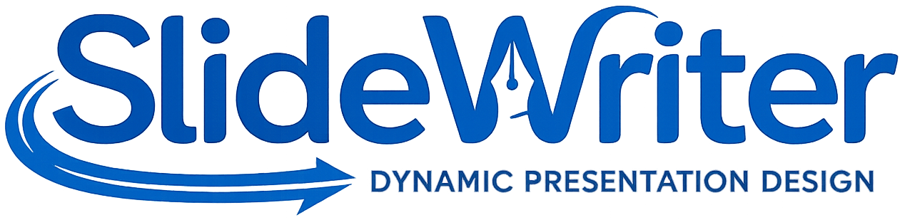
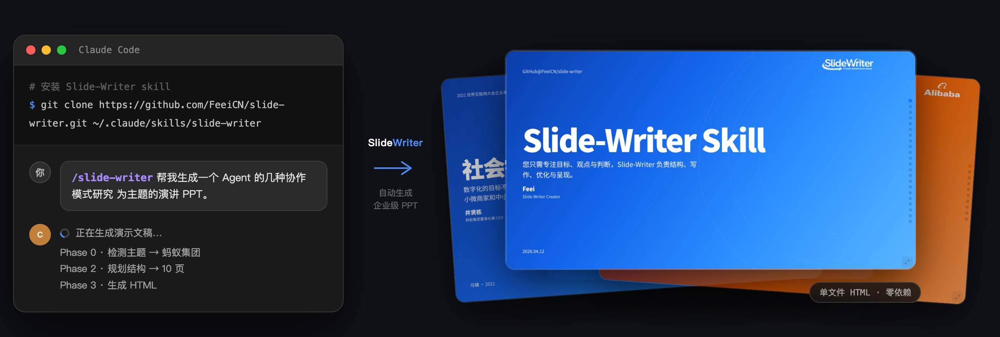

<p align="center">
  
</p>

# Slide-Writer

[](https://github.com/FeeiCN/slide-writer/releases)
[](https://opensource.org/licenses/MIT)
[](https://feei.cn/slide-writer/)
[](README.zh-CN.md)

> Focus on goals, viewpoints, and judgment. Slide-Writer handles structure, writing, refinement, and presentation.

<p align="center">
  
</p>

## Quick Start

```bash
# Claude Code
git clone https://github.com/FeeiCN/slide-writer.git ~/.claude/skills/slide-writer

# Codex
git clone https://github.com/FeeiCN/slide-writer.git ~/.agents/skills/slide-writer
```

```text
/slide-writer Generate a presentation on "Why do humans need to eat?" using Alipay style.
```

```text
/slide-writer Use the speech draft in examples/tencent-pony-ma.md to generate a presentation.
```

```text
/slide-writer I have a speech tomorrow. Turn examples/alibaba-ai-rollout.md into a deck.
```

## Core Features

**Easy to use**: generate a complete deck from a sentence, outline, draft, or speech manuscript.
- Generate a deck from a single idea or theme
- Turn a speech draft into slides
- Expand an outline into a full presentation
- Convert notes, documents, or reports into slides
- Improve or resize an existing HTML slide deck
- Produce multiple audience-specific versions from the same source

**Enterprise-grade visual language**: built for formal scenarios such as executive reviews, internal communication, cross-team updates, and summit speeches.
- 14 internet-company brand themes with automatic detection and switching
- Unified logo display, colors, typography, and layout conventions
- Precise alignment, consistent spacing, and professional visual rhythm

**Complete presentation structure**: automatically plans sections, splits dense content across slides, and converts document-style writing into presentation-style writing.
- Cover, agenda, section divider, and closing slides
- Reuses established page skeletons instead of rebuilding every slide from scratch

**Automatic rewriting and content restructuring**: rewrites content into presentation form — clearer, tighter, and more suitable for speaking.
- Refines titles, bullet hierarchy, and paragraph structure
- Polishes wording for stronger clarity and sharper expression

**Rich page-level expression**: animations, data visualization, step diagrams, tables, card layouts, and more — all without external libraries.
- Bar charts, line charts, donut charts via inline SVG
- Step and flow diagrams, mixed image/text layouts, card-based information presentation

**Single-file delivery**: outputs a standalone HTML file. No PowerPoint, no Keynote, no dependencies.
- CSS / JS / images all embedded
- Keyboard navigation, navigation dots, fullscreen mode
- Responsive layout for screens and projectors

**Always up to date**: automatically pulls the latest version on every run — new themes, components, and rules without manual updates.

## Repository Structure

- `SKILL.md`: skill definition and execution rules
- `themes.md`: theme and logo rules
- `components.md`: page component library
- `index.html`: baseline template and page skeleton gallery
- `examples/`: sample inputs and outputs
- `TESTING.md`: testing notes

### Quick Test

1. Pick one sample from [examples](examples).
2. Ask the model to generate a `test-*.html` based on this repo's `SKILL.md`.
3. Run:

```bash
./scripts/preview.sh
```

4. Open `http://localhost:8000/test-xxx.html` in a browser.

See [TESTING.md](TESTING.md) for the full testing flow and regression checklist.
